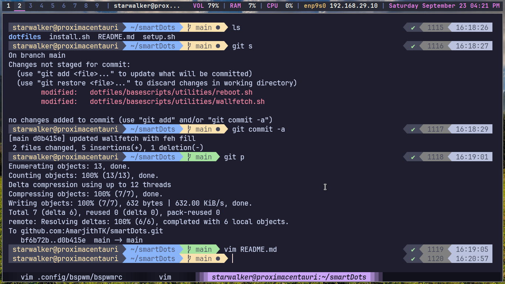
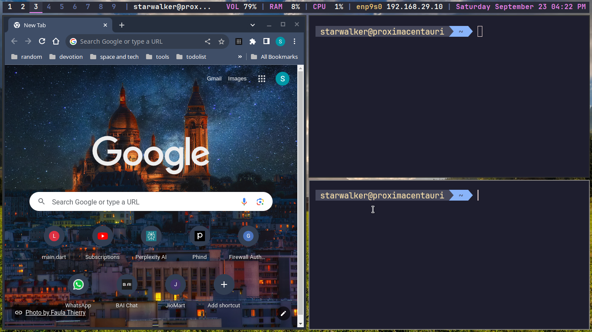

# Latest Edition of my dotfiles, now even more smart with gnu stow

 ### TODOS for freetime, only when lots of free 

<<<<<<< HEAD
    amVim is the vimextension that works very well 
=======
    on polybar add battery : battery percent

    and add dunst notify for battery below 30 - 40 % 

    use brillo to adjust screen brightness properly, add video group and set rules accordingly as needed 
>>>>>>> f33e5573ce8690f15848dd9a32f225d839f37073

    add small indicator inside workspace number to tell the user how many windows are there in the workspace when in monocle layout and other normal modes

    ability to add different files for different devices that is joined with bspwrc bash devicespecificautostartetc.sh

    add a workspace for chatgpt or a scratchpad for chatgpt with a keybinding also assign workspace
    add natural langugage processing to make machine learn how add google calendar based on terminal input or simple text input from phone!!!

    - press :W (capital) to get cheatsheet

    unset BROWSER
    xdg-settings set default-web-browser google-chrome.desktop
    for node run

    add check date and time getting removed D.T wlan0 in laptops
    remove redundant rofi launcher sxhkd keybinds and cleanup the sxhdrc

    - create a clipboard for yourself with nodejs and host it with a pincode that can be changed with time by master password and bit.ly or something short code
    - add create basescripts/binaries folder and add it to path and move all the all time usage scripts to there
        - add to path binaries folder

    - add feature to download audio only playlist without video also and use audio only using framwork process
    - make microsoft bat equivalent files of this using chatgpt or something
    - chocolatey make ps1 script to setup windows easily with all setup and add it to a seperate branch

    - add restriction on the wlan0 name of wifi connected on polybar
    - add restriction on if wlan0 connected then eth0 automatically removed and try to just use wifi symbol, use chatgpt for this purpose

    - add dunst theme , in catpuccin
    - add dynamic or something better wallpapers
    - use mountain wallpaper if possible source.unsplash/mountain or something
    - implement system tray for bspwm
    - implment scratchpad functionality ( using tdrop if possible )
    - add conkyrc if possible, not too much needed 
    - learn eww widgets, the least priority one, the most timewaste

* Arch Linux + bspwm/ DWM , XFCE and lightweight distro
* ZSH
* Rofi
* NVIM nvchad
* preconfigured vscodium
* ssh autoconfig script
* automatic venv activation script
* script to manage appimages and provide launchers for them
* coding eye friendly jetbrains mono/ fira code fonts
* Firewall for NITC Students ( Deprecated )

## To install just hit

    curl -Lo install.sh raw.github.usercontent/install.sh (get the actual url ) | bash install.sh | rm install.sh
