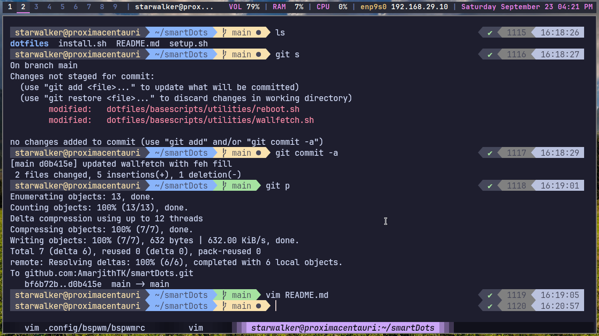

# smartDots - Modern Dotfiles with GNU Stow Integration

**Author:** AmarjithTK

##### windows users checkout the windows branch for KDE plasma like setup

smartDots is a comprehensive dotfiles setup for Linux, designed for productivity, intelligent defaults, and easy management using [GNU Stow](https://www.gnu.org/software/stow/). It supports multiple window managers, advanced shell configurations, and a streamlined development environment.

---

## Quick Install

Clone and run the setup script:
```bash
git clone -b main2 --single-branch --depth 1 git@github.com:AmarjithTK/smartDots.git ~/smartDots
bash ~/smartDots/setup.sh
```

**Alternative:**
```bash
curl -Lo install.sh https://raw.githubusercontent.com/AmarjithTK/smartDots/main2/install.sh
bash install.sh
rm install.sh
```



---

## Features

### Window Managers
- **Arch Linux** with:
  - BSPWM
  - DWM
  - XFCE (lightweight fallback)

### Shell & Terminal
- ZSH with custom configs
- Rofi launcher

### Development Environment
- NVIM (NvChad)
- VSCodium (amVim extension)
- SSH autoconfig script
- Automatic Python venv activation
- AppImage management with launchers

### Fonts
- JetBrains Mono
- Fira Code

### Legacy
- NITC Firewall (Deprecated)

---

## Planned Improvements

### System & WM
- Window count indicator (monocle layout)
- ChatGPT workspace/scratchpad keybinding
- Device-specific autostart scripts
- BSPWM system tray
- Scratchpad (tdrop)
- Dynamic wallpapers (Unsplash mountain themes)
- Conky configuration
- EWW widgets

### Tools & Utilities
- FZF fuzzy finder
- Bluetooth management (bluez/blueberry)
- Volume control & limiter, AutoEQ
- Custom clipboard manager (NodeJS backend, PIN security, URL shortener)
- Binary management (`basescripts/binaries` folder, PATH integration)

### UI/UX
- Polybar battery indicator
- Dunst battery notifications (30-40% threshold)
- Screen brightness control (brillo)
- Network indicators (wlan0/eth0 switching)
- Dunst theming (Catppuccin)

### Documentation
- Vim cheatsheet (`:W` command)
- Cleanup redundant Rofi bindings
- Organize sxhkd config

### Cross-platform
- Windows setup script (Chocolatey)
- BAT file equivalents

### Automation
- Natural language Google Calendar integration
- Audio-only playlist downloader
- Browser configuration:
  ```bash
  unset BROWSER
  xdg-settings set default-web-browser google-chrome.desktop
  ```

### Android Integration
**Recommended Apps:**
- **Media:** Namida, Next Video Player, Musicolet, Wavelet
- **Utilities:** VolumeLockr (custom mod planned), LocalSend

---

## Contributing

Issues and enhancement requests are welcome!

---

## Browser Configuration

Set your default browser:
```bash
unset BROWSER
xdg-settings set default-web-browser google-chrome.desktop
```

---

## Installation Notes

**Always review scripts before running:**
```bash
curl -Lo install.sh https://raw.githubusercontent.com/AmarjithTK/smartDots/main2/install.sh
bash install.sh
rm install.sh
```

---

## License

MIT License

---

## Corrections & Suggestions

- **Consistency:** Use the same repository URL format everywhere.
- **Clarity:** Specify full URLs for scripts and images.
- **Security:** Advise users to review scripts before running.
- **Formatting:** Use clear headings, bullet points, and code blocks.
- **Professional Tone:** Avoid casual language; keep instructions concise.
- **Cross-platform:** Mention Windows support as planned, not current.
- **Image Links:** Ensure `assets/scrot1.png` exists or update the path.

---

**Feel free to further customize this README to match your workflow and preferences.**
