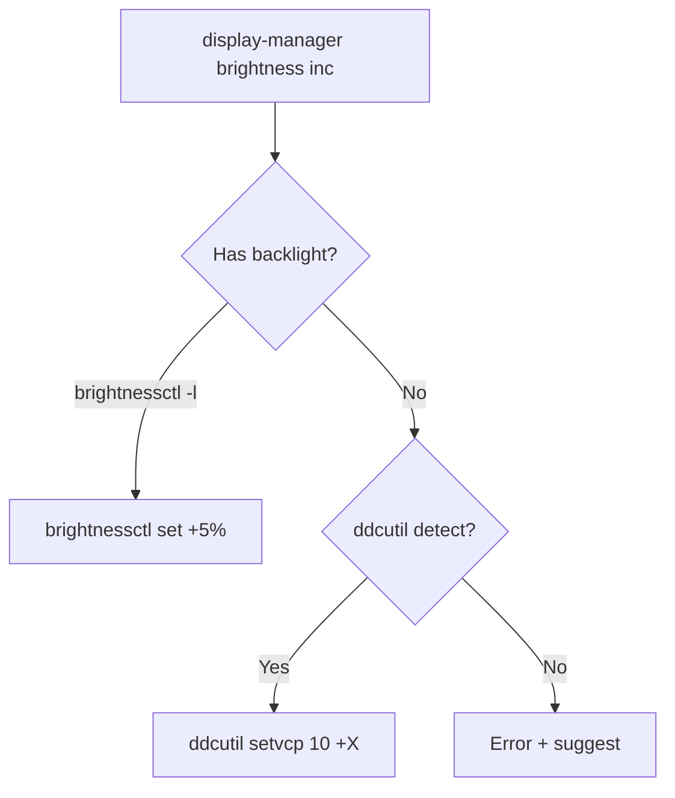

# DDC/CI Brightness Fix — KDE Plasma Applet + Persistence Plan

## Problem

KDE Plasma only shows brightness slider for **laptops** (ACPI backlight). Desktop monitors with **DDC/CI** support get no slider. Brightness also resets on reboot.

## Solution — 4 Parts

```
┌──────────────────────────────────────────────────────────┐
│                    KDE Plasma Panel                        │
│  ┌──────────────────────────────────────────────────┐    │
│  │  ⚙️  [═══━━━━━━━━━]  🔈 [━━━━━━━━━]  🔋 90%    │    │
│  │                   ▲                                │    │
│  │           Brillo Applet (QML)                      │    │
│  │           calls display-manager set <val>          │    │
│  └──────────────────┼───────────────────────────────────┘    │
│                     │                                        │
│                     ▼                                        │
│  ┌──────────────────────────────────────────────────┐    │
│  │         display-manager (auto-detect)              │    │
│  │  brightnessctl (laptop)  │  ddcutil (desktop)     │    │
│  │                          │                        │    │
│  │  ┌──────────────────────┐│┌────────────────────┐  │    │
│  │  │ brightness-state.txt │││ Persistence file   │  │    │
│  │  └──────────────────────┘│└────────────────────┘  │    │
│  └──────────────────────────────────────────────────┘    │
│                     │                                        │
│                     ▼                                        │
│  ┌──────────────────────────────────────────────────┐    │
│  │  KDE Autostart (restore-brightness.desktop)       │    │
│  │  → display-manager brightness restore             │    │
│  │  → reads saved state → applies on login           │    │
│  └──────────────────────────────────────────────────┘    │
└──────────────────────────────────────────────────────────┘
```

---

## Part 1: Update `display-manager` 

### Auto-Detection


### New Subcommands

| Subcommand | Action |
|-----------|--------|
| `brightness inc` | Increase by 5% (auto-detect method) |
| `brightness dec` | Decrease by 5% |
| `brightness set 70` | Set absolute brightness to 70% |
| `brightness get` | Get current brightness % |
| `brightness gui` | Show kdialog slider (for testing) |
| `brightness save` | Save current brightness to state file |
| `brightness restore` | Restore brightness from state file |
| `status` | Show detection info (method, monitors) |

### Persistence File
```bash
STATE_FILE="$HOME/.helpers/brightness-state.txt"
# Content: "ddcutil|brightnessctl <value>"
# Example: "ddcutil 75" or "brightnessctl 50"
```

---

## Part 2: KDE Plasma Applet ("Brillo")

A simple QML-based Plasmoid that shows a brightness slider in the KDE panel.

### Directory (stowable)
```
linux/stow/plasmoids/brillo/
├── metadata.json
└── contents/
    └── ui/
        └── main.qml
```

### `metadata.json`
```json
{
    "KPlugin": {
        "Id": "org.amarjithtk.brillo",
        "Name": "Brillo — DDC Brightness",
        "Description": "Brightness slider for desktop monitors via DDC/CI",
        "Icon": "brightnesssettings",
        "Version": "1.0",
        "License": "MIT",
        "Authors": [{"Name": "AmarjithTK", "Email": ""}]
    },
    "X-Plasma-API": "declarativeappletscript",
    "X-Plasma-MainScript": "ui/main.qml"
}
```

### `main.qml` (simplified)
```qml
import QtQuick 2.0
import QtQuick.Layouts 1.1
import org.kde.plasma.core 2.0 as PlasmaCore
import org.kde.plasma.components 3.0 as PlasmaComponents

Item {
    PlasmaCore.DataSource {
        id: executor
        engine: "executable"
        connectedSources: []
        onNewData: {
            // Handle brightness response
        }
    }

    Slider {
        id: brightnessSlider
        from: 0; to: 100; value: 50
        onValueChanged: {
            executor.connectSource("display-manager brightness set " + value)
        }
    }

    // Load saved state on startup
    Component.onCompleted: {
        executor.connectSource("display-manager brightness get")
    }
}
```

### Installation via stow
- `linux/stow/plasmoids/` → stow to `~/.local/share/plasma/plasmoids/`
- User adds "Brillo" widget to panel via Widget Explorer

---

## Part 3: Brightness Persistence (Auto-Restore on Login)

### Mechanism
1. **Save**: `display-manager brightness save` — writes current brightness to `~/.helpers/brightness-state.txt`
2. **Restore**: `display-manager brightness restore` — reads state and applies
3. **Triggers**:
   - Save: called by the Plasmoid applet whenever slider changes
   - Restore: KDE autostart `.desktop` file runs on login

### Files
- State file: `~/.helpers/brightness-state.txt`
- Autostart: [`linux/stow/plasma-autostart/restore-brightness.desktop`](linux/stow/plasma-autostart/restore-brightness.desktop)

### `restore-brightness.desktop`
```desktop
[Desktop Entry]
Type=Application
Name=Restore Display Brightness
Comment=Restore monitor brightness from last saved state
Exec=$HOME/.local/bin/display-manager brightness restore
Terminal=false
X-KDE-autostart-phase=2
```

---

## Part 4: Permissions & Package Setup

Update [`linux/setup/packages.sh`](linux/setup/packages.sh) to include:

```bash
# DDC/CI brightness control for desktop monitors
sudo pacman -S --noconfirm ddcutil
sudo modprobe i2c-dev
echo "i2c-dev" | sudo tee /etc/modules-load.d/i2c-dev.conf >/dev/null
sudo usermod -aG i2c "$USER"
```

---

## Full User Experience

```
Boot → KDE starts → restore-brightness.desktop runs
  → display-manager brightness restore
  → Reads ~/.helpers/brightness-state.txt
  → Applies ddcutil setvcp 10 <saved_value>

User sees slider in panel → drags to 70%
  → Plasmoid calls: display-manager brightness set 70
  → ddcutil setvcp 10 <value>
  → display-manager brightness save
  → Writes "ddcutil 70" to brightness-state.txt

Monitor brightness changes in real-time via DDC/CI
```

---

## Files to Create/Modify

| File | Action |
|------|--------|
| `linux/bin/display-manager` | **Modify** — add ddcutil, persistence, gui, detect, status |
| `linux/stow/plasmoids/brillo/metadata.json` | **Create** — applet metadata |
| `linux/stow/plasmoids/brillo/contents/ui/main.qml` | **Create** — slider UI |
| `linux/stow/plasma-autostart/restore-brightness.desktop` | **Create** — restore on login |
| `linux/setup/packages.sh` | **Modify** — add ddcutil + i2c group |
