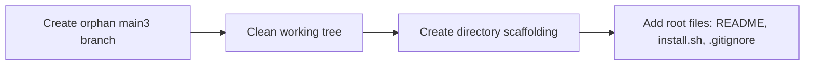
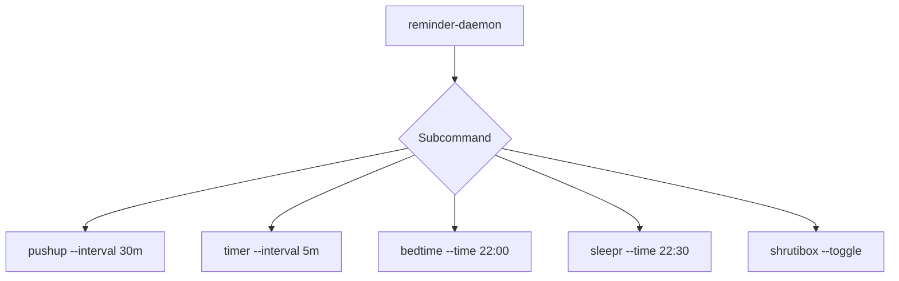
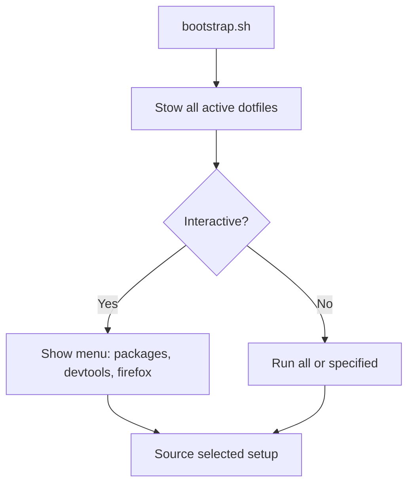
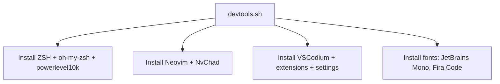
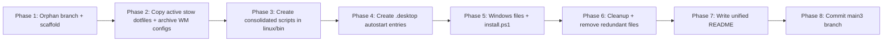

# main3 Restructure Plan: Cross-Platform Unified Dotfiles

## Objective

Create an orphan `main3` branch that unifies the Linux (`main2`) and Windows (`windows`) dotfiles into a single, well-organized repository with massive simplification — reducing ~60+ individual scripts down to ~15-18 consolidated files. Since the primary desktop is **KDE Plasma**, BSPWM/DWM-specific configs will be archived.

## Architecture Overview

```
smartdots_linux_windows/
├── README.md
├── install.sh
│
├── linux/
│   ├── setup/
│   ├── stow/
│   ├── bin/
│   ├── helpers/
│   └── docker/
│
├── windows/
│   ├── window_switcher.ahk
│   ├── VirtualDesktopAccessor.dll
│   └── install.ps1
│
├── shared/
│   └── git/
│
├── archive/              # WM-specific configs (BSPWM, DWM, Polybar, Picom, sxhkd)
│
└── assets/
```

---

## Phase 1: Create Orphan Branch & Directory Scaffolding



**Steps:**
1. `git checkout --orphan main3` — creates a new branch with no commit history
2. `git rm -rf .` — clear the working tree
3. Create all directories and root-level files
4. Commit the empty structure

**Root files:**
- [`README.md`](plans/main3-restructure-plan.md) — unified documentation for both platforms
- [`install.sh`](plans/main3-restructure-plan.md) — cross-platform installer (detects OS and delegates to linux/setup/bootstrap.sh or windows/install.ps1)
- [`.gitignore`](plans/main3-restructure-plan.md) — clean gitignore for both platforms

---

## Phase 2: Stow Dotfiles (Linux — Plasma-First)

Migrate from `dotfiles/` → organized per-app directories under `linux/stow/`. WM-specific configs go to `archive/`.

| Current Path | New Path | Notes |
|-------------|----------|-------|
| `dotfiles/.gitconfig` | `shared/git/.gitconfig` | Cross-platform, keep active |
| `dotfiles/.gitignore_global` | `shared/git/.gitignore_global` | Cross-platform, keep active |
| `dotfiles/.zshrc` | `linux/stow/shell/.zshrc` | KDE-compatible, keep active |
| `dotfiles/.zshconfig` | `linux/stow/shell/.zshconfig` | Clean duplicate aliases |
| `dotfiles/.config/kitty/kitty.conf` | `linux/stow/kitty/kitty.conf` | KDE-compatible, keep active |
| `dotfiles/.config/kitty/nord.conf` | `linux/stow/kitty/nord.conf` | KDE-compatible, keep active |
| `dotfiles/.config/rofi/config.rasi` | `linux/stow/rofi/config.rasi` | Works in Plasma, keep active |
| `dotfiles/.config/rofi/nord.rasi` | `linux/stow/rofi/nord.rasi` | Works in Plasma, keep active |
| `dotfiles/.config/dunst/dunstrc` | `linux/stow/dunst/dunstrc` | Replaces KDE notifications |
| `dotfiles/.config/firefox/userChrome.css` | `linux/stow/firefox/userChrome.css` | Keep active |
| `dotfiles/.config/bspwm/bspwmrc` | `archive/stow/bspwm/bspwmrc` | **Archive** — BSPWM-specific |
| `dotfiles/.config/sxhkd/bspwm-sxhdrc` | `archive/stow/sxhkd/bspwmrc` | **Archive** — BSPWM-specific |
| `dotfiles/.config/sxhkd/alone-sxhkdrc` | `archive/stow/sxhkd/standalone` | **Archive** — non-Plasma |
| `dotfiles/.config/polybar/config.ini` | `archive/stow/polybar/config.ini` | **Archive** — not used in Plasma |
| `dotfiles/.config/polybar/config.ini.bak` | Drop | Backup, not needed |
| `dotfiles/.config/picom/picom.conf` | `archive/stow/picom/picom.conf` | **Archive** — KWin replaces |

---

## Phase 3: Script Consolidation (Plasma-First)

Since you're on KDE Plasma, scripts that rely on BSPWM/sxhkd/dmenu will be archived. Only Plasma-compatible utilities remain active.

### [3.1] Display Manager — Merges 3 scripts into 1

| Original Script | Lines | Function | Destination |
|----------------|-------|----------|-------------|
| `brightness_control.sh` | 38 | Brightness via `brightnessctl` | Active — works in Plasma |
| `colortemp.sh` | 45 | Color temp via `redshift` | Active — works in Plasma |
| `grayscale_toggle.sh` | 224 | Grayscale via picom/nvidia/ddc | **Archive** — picom-specific |

Since the grayscale script is picom-specific and you're on KWin, only `brightness_control.sh` + `colortemp.sh` merge. Grayscale goes to `archive/`.

**New file:** `linux/bin/display-manager`
**Subcommands:** `brightness inc|dec`, `colortemp inc|dec`
**Lines:** ~83 → ~60

---

### [3.2] Wallpaper Manager — Merges 4 scripts into 1

| Original Script | Lines | Function | Destination |
|----------------|-------|----------|-------------|
| `walld` | 3 | Unsplash fetch | Active — works in Plasma |
| `wallfetch` | 39 | Daily wallpaper daemon | Active — works in Plasma |
| `sfwallpaper.sh` | 32 | Pexels special forces | Active — works in Plasma |
| `greeterwall.sh` | 53 | LightDM greeter | **Archive** — SDDM in Plasma |

**New file:** `linux/bin/wallpaper`
**Subcommands:** `fetch` (daily), `random` (unsplash), `pexels` (special forces)
**Lines:** ~74 → ~55

---

### [3.3] Scratchpad Manager — Merges 2 scripts into 1

| Original Script | Lines | Function | Destination |
|----------------|-------|----------|-------------|
| `scpad.sh` | 44 | Firefox/kitty scratchpad toggle | **Archive** — uses xdotool/wmctrl, BSPWM-centric |
| `gptscratchpad.sh` | 50 | Qutebrowser GPT scratchpad | **Archive** — similar reason |

KDE Plasma has built-in window management (kstart5, window rules). These can be removed from active and optionally recreated later as Plasma-specific.

**New file:** (Not created now — can be a future Plasma-specific script)
**Archive:** Both scripts moved to `archive/`

---

### [3.4] Power Menu — Merges 3 scripts into 1

| Original Script | Lines | Function | Destination |
|----------------|-------|----------|-------------|
| `powermenu-rofi.sh` | 24 | Rofi powermenu | Active — Rofi works in Plasma |
| `binaries/powermenu-rofi` | 24 | Rofi powermenu (duplicate!) | Drop — duplicate |
| `dmenu-powermenu` | 24 | dmenu powermenu | **Archive** — dmenu not used |
| `powermenu-rofi.sh` (duplicate) | 24 | Rofi powermenu | Drop — duplicate |

**New file:** `linux/bin/powermenu`
**Lines:** ~48 → ~35

---

### [3.5] Config Editor — Merges 2 scripts into 1

| Original Script | Lines | Function | Destination |
|----------------|-------|----------|-------------|
| `editdotfiles.sh` | 44 | Rofi-based config editor | Active — works in Plasma |
| `dmenuconfig.sh` | 75 | dmenu-based config editor | **Archive** — dmenu not used |

**New file:** `linux/bin/config-editor`
**Lines:** ~44 → ~40

---

### [3.6] Reminder Daemon — Merges 5 scripts into 1

| Original Script | Lines | Function | Destination |
|----------------|-------|----------|-------------|
| `pushup.sh` | 17 | 30-min pushup reminder | Active — works in Plasma |
| `5minutes.sh` | 24 | 5-minute beep timer | Active — works in Plasma |
| `bedtime.sh` | 32 | Bedtime shutdown at 22:00 | Active — works in Plasma |
| `sleepr.sh` | 42 | Late-night harassment | Active — works in Plasma |
| `shrutibox.sh` | 14 | Toggle MP3 loop playback | Active — works in Plasma |



**New file:** `linux/bin/reminder-daemon`
**Lines:** ~129 → ~80

---

### [3.7] YouTube Downloader — Merges 2 scripts into 1

| Original Script | Lines | Function | Destination |
|----------------|-------|----------|-------------|
| `ytdl` | 50 | yt-dlp downloader v1 | Drop — superseded by v2 |
| `ytdlp-v2` | 53 | yt-dlp downloader v2 | Active |

**New file:** `linux/bin/yt-dlp`
**Lines:** ~53 → ~50 (cleanup, no functional merge since v1 is superseded)

---

### [3.8] Autostart — KDE Plasma Only (Merge + Simplify)

| Original Script | Lines | Function | Destination |
|----------------|-------|----------|-------------|
| `autostart.sh` | 57 | BSPWM + Plasma + device-specific | **Archive** — mix of BSPWM/Plasma |
| `autostart_plasma.sh` | 7 | Plasma autostart calls | Active base |

KDE Plasma uses `~/.config/autostart/` for desktop files, not shell scripts. Instead of a script, create `.desktop` files in `linux/stow/plasma-autostart/`.

**New file:** `linux/stow/plasma-autostart/` containing `.desktop` entries for:
- `reminder-daemon.desktop` → runs in background
- `idle-monitor.desktop` → runs in background
- `battery-monitor.desktop` → runs in background
- `wallpaper.desktop` → runs daily fetch

**Lines:** ~64 → ~20 (5 .desktop files)

---

### [3.9] Keep Standalone (Intact or Minimal Change)

These scripts serve distinct, non-overlapping purposes:

| Script | New Location | Status |
|--------|-------------|--------|
| `notify2.sh` — Idle monitor | `linux/bin/idle-monitor` | Active, update desktop integration |
| `notifybattery.sh` — Battery monitor | `linux/bin/battery-monitor` | Active |
| `chrome_rofi.sh` — Web launcher | `linux/bin/web-launcher` | Active |
| `restart-sxhkd` — SXHKD restart | `archive/bin/restart-sxhkd` | **Archive** — sxhkd not used |
| `appimagemanager.sh` | `linux/bin/appimage` | Active |
| `venvmanager` | `linux/bin/venv` | Active |
| `pacmanupdate.sh` | `linux/bin/check-updates` | Active |
| `jiotv` binary | `archive/bin/jiotv` | **Archive** — not KDE-specific |

---

### [3.10] Setup Scripts — Simplify from 8 to 3

| Current | New | Changes |
|---------|-----|---------|
| `install.sh` | `install.sh` | Detect OS → delegate to Linux setup or Windows install |
| `setup.sh` | Merged into `bootstrap.sh` | Contains stow command |
| `runner.sh` | Merged into `bootstrap.sh` | Interactive menu logic absorbed |
| `basepackages.setup` | `linux/setup/packages.sh` | Rename for clarity |
| `nvim.setup` + `vscode.setup` + `zsh.setup` | `linux/setup/devtools.sh` | **Merged** — all dev tooling in one script |
| `firefoxtheme.setup` | `linux/setup/firefox.sh` | Rename for consistency |

**New file:** `linux/setup/bootstrap.sh`



**New file:** `linux/setup/devtools.sh` (merges nvim + vscode + zsh)



---

## Phase 4: Windows Files

| File | New Location | Status |
|------|-------------|--------|
| `README.md` | `windows/README.md` | Update for Windows-only docs |
| `window_switcher.ahk` | `windows/window_switcher.ahk` | Keep as-is |
| `VirtualDesktopAccessor.dll` | `windows/VirtualDesktopAccessor.dll` | Keep as-is |
| **New:** `windows/install.ps1` | PowerShell installer | Create new |

**Install script:** `windows/install.ps1`
- Check if AutoHotkey v2 is installed (offer to install via winget if available)
- Copy files to `C:/smartDots`
- Create startup shortcut in `shell:startup`
- Simple, no heavy dependencies

---

## Phase 5: Archive Folder Contents

All files moved to `archive/` are preserved for reference but not symlinked by `bootstrap.sh`:

```
archive/
├── README.md                        # Explains what's archived and why
├── stow/
│   ├── bspwm/bspwmrc                # BSPWM window manager config
│   ├── sxhkd/bspwmrc                # BSPWM hotkey daemon config
│   ├── sxhkd/standalone             # Standalone sxhkd config
│   ├── polybar/config.ini           # Polybar status bar config
│   └── picom/picom.conf             # Picom compositor config
├── bin/
│   ├── restart-sxhkd                # sxhkd restart helper
│   ├── grayscale                    # picom/nvidia grayscale toggle
│   ├── dmenu-powermenu              # dmenu power menu
│   ├── dmenuconfig.sh               # dmenu config editor
│   ├── scpad.sh                     # BSPWM scratchpad
│   ├── gptscratchpad.sh             # BSPWM GPT scratchpad
│   └── jiotv                        # JIOTV binary
└── setup/
    └── greeterwall.sh               # LightDM greeter wallpaper
```

---

## Phase 6: Cleanup Items

**Remove permanently (no value in archive):**
- `dotfiles/basescripts/configs/archives/` — All `.bak` files (7 files). Redundant with git history.
- `dotfiles/.config/polybar/config.ini.bak` — Backup, not needed
- `dotfiles/.config/dunst/dunst` — Raw binary file
- `dotfiles/.gitignore` — Redundant with root `.gitignore`
- `dotfiles/.gitattributes` — Redundant with root `.gitattributes`
- `notes.md` — Single note about `xclip` → incorporate into README
- `install.sh` — Replace with new cross-platform version
- `setup.sh` — Logic absorbed into `bootstrap.sh`

---

## Summary: Before vs After

| Metric | Before (main2) | After (main3) | Reduction |
|--------|----------------|---------------|-----------|
| Total files | ~60+ | ~35 | ~42% |
| Active utility scripts | 27+ | 12 | ~56% |
| Archived scripts | 0 | 9 (moved) | — |
| Config editors | 2 | 1 | 50% |
| Powermenu scripts | 3 (rofi x2 + dmenu) | 1 | 66% |
| Wallpaper scripts | 4 | 1 | 75% |
| Scratchpad scripts | 2 | 0 (archived) | 100% |
| Audio/reminder scripts | 5 | 1 | 80% |
| YouTube downloaders | 2 | 1 | 50% |
| Setup scripts | 8 | 4 (incl. bootstrap) | 50% |
| Archive/bak files | 8 | 0 (+ 9 archived) | 100% |
| Windows files | 3 | 4 | +1 (install.ps1) |

## Estimated Line Count Reduction (Active Only)

| Category | Before (lines) | After (lines) | Δ |
|----------|---------------|---------------|---|
| Display scripts | 83 | 60 | -23 |
| Wallpaper scripts | 74 | 55 | -19 |
| Power menu scripts | 48 | 35 | -13 |
| Config editor | 44 | 40 | -4 |
| Reminder scripts | 129 | 80 | -49 |
| YouTube downloader | 53 | 50 | -3 |
| Autostart (sh → .desktop) | 64 | 20 | -44 |
| Setup/runner scripts | 76 | 60 | -16 |
| Archive/bak files | 210 | 0 | -210 |
| **Active total** | **~1100** | **~500** | **~55%** |

---

## Migration Steps (Execution Order)



### Detailed Execution Steps

**Step 1:** Create orphan branch
```bash
git checkout --orphan main3
git rm -rf .
```

**Step 2:** Create directory structure
```bash
mkdir -p linux/{setup,stow/{shell,kitty,rofi,dunst,firefox,plasma-autostart},bin,helpers/musics,docker/wordpress}
mkdir -p windows
mkdir -p shared/git
mkdir -p archive/{stow/{bspwm,sxhkd,polybar,picom},bin,setup}
```

**Step 3:** Copy active stow configs from `main2` via `git show main2:{path}`

**Step 4:** Move WM-specific configs to `archive/`

**Step 5:** Create consolidated scripts in `linux/bin/`:
- `display-manager` — brightness + colortemp
- `wallpaper` — fetch + random + pexels
- `powermenu` — rofi-based
- `config-editor` — rofi-based
- `reminder-daemon` — pushup + timer + bedtime + sleepr + shrutibox
- `yt-dlp` — cleaned up downloader
- `idle-monitor` — from notify2.sh
- `battery-monitor` — from notifybattery.sh
- `web-launcher` — from chrome_rofi.sh
- `appimage` — from appimagemanager.sh
- `venv` — from venvmanager
- `check-updates` — from pacmanupdate.sh

**Step 6:** Create `.desktop` files in `linux/stow/plasma-autostart/`

**Step 7:** Copy Windows files + create `windows/install.ps1`

**Step 8:** Remove redundant files

**Step 9:** Write unified `README.md` with platform badges

**Step 10:** Commit and push `main3` branch

---

## Key Design Principles for main3

1. **Plasma-first**: Configs and scripts for KDE Plasma are active; everything else is archived
2. **CLI-first**: Every utility is callable with subcommands/arguments
3. **Auto-detection**: Prefer detecting available tools over hardcoding
4. **Platform-aware**: `install.sh` detects OS at the top level
5. **Minimal dependencies**: Each script explicitly declares dependencies
6. **Self-documenting**: All scripts have `--help` flag
7. **No duplicates**: If two scripts do similar things, merge them
8. **Use git history, not .bak files**: No backup files in the repository
9. **Consistent naming**: All scripts in `bin/` have lowercase hyphenated names
10. **Archived ≠ deleted**: All WM-specific configs preserved in `archive/` for future use
