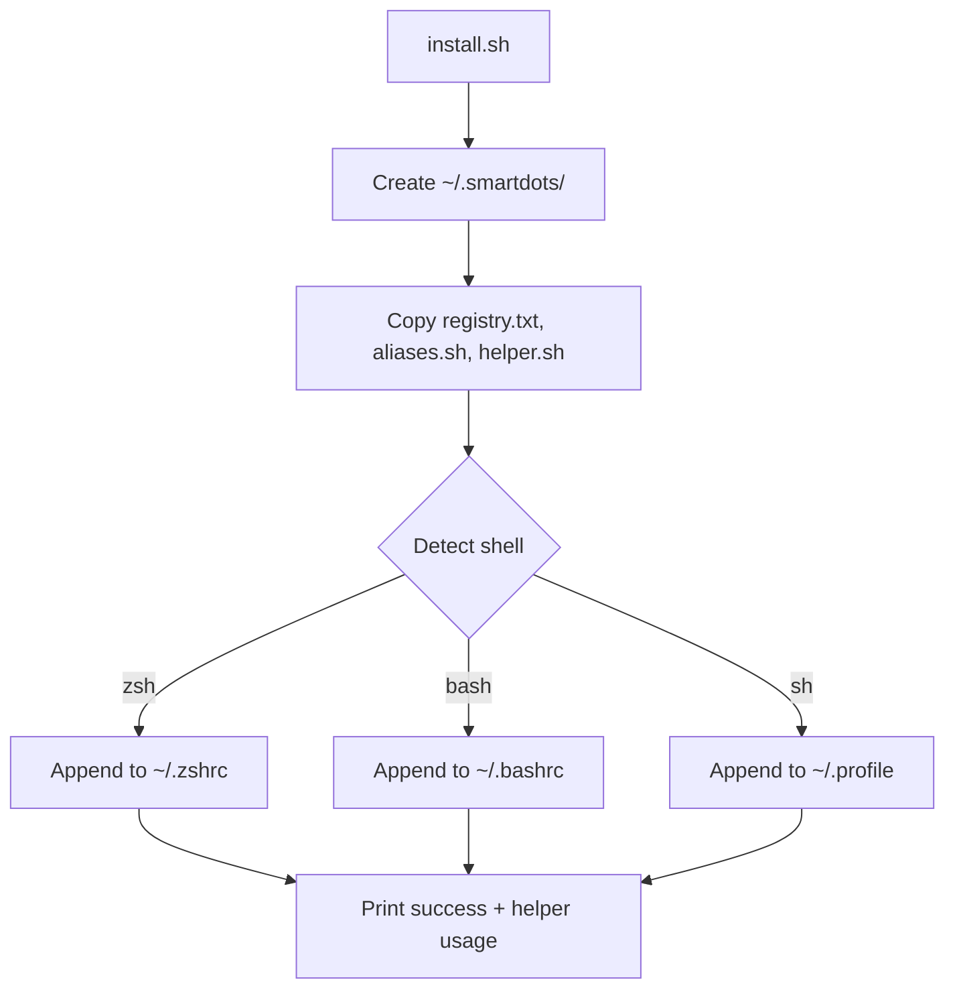

# smartDots CLI Toolkit — v1 Plan

## Scope

A lightweight alias registry with discoverability. No bloat.

## What we build

```
~/.smartdots/
├── registry.txt        # Category|alias|command
├── aliases.sh          # Sources registry, defines aliases
├── helper.sh           # The helper command
└── install.sh          # One-command install
```

## 4 files total

### 1. `registry.txt`

Pipe-delimited, 3 columns:

```
flutter|fpg|flutter pub get
flutter|fc|flutter clean
flutter|fcp|flutter clean && flutter pub get
flutter|fr|flutter run
flutter|frc|flutter run -d chrome
flutter|frw|flutter run -d web-server
flutter|frl|flutter run -d linux
flutter|fra|flutter run -d android
flutter|fba|flutter build apk
flutter|fbas|flutter build apk --split-per-abi
flutter|fbaa|flutter build appbundle
flutter|fbw|flutter build web
flutter|fbl|flutter build linux
flutter|fan|flutter analyze
flutter|ffix|dart fix --apply
git|gs|git status
git|gl|git log --oneline --graph
git|gd|git diff
git|ga|git add .
git|gau|git add -u
git|gc|git commit
git|gcm|git commit -m
git|gca|git add . && git commit -m
git|gcap|git add . && git commit -m && git push
git|gp|git pull
git|gps|git push
git|gpsu|git push -u origin HEAD
git|gb|git branch
git|gco|git checkout
git|gsw|git switch
npm|ni|npm install
npm|nid|npm install --save-dev
npm|ns|npm start
npm|nd|npm run dev
npm|nb|npm run build
npm|nt|npm test
pnpm|pi|pnpm install
pnpm|pd|pnpm dev
pnpm|pb|pnpm build
bun|bi|bun install
bun|bd|bun dev
bun|bb|bun build
docker|dps|docker ps
docker|dimg|docker images
docker|dc|docker compose
docker|dcu|docker compose up
docker|dcd|docker compose down
system|ll|ls -lah
system|la|ls -A
system|c|clear
system|h|history
system|myip|curl ifconfig.me
system|ports|ss -tulpn
```

### 2. `aliases.sh`

Sourced by shell. Defines all aliases from registry.

```bash
# Read registry.txt line by line
while IFS='|' read -r category alias_name command; do
    # Skip comments and empty lines
    [[ "$category" =~ ^#.*$ || -z "$category" ]] && continue
    # Create the alias
    alias "$alias_name"="$command"
done < "$HOME/.smartdots/registry.txt"
```

### 3. `helper.sh`

The discovery command. Sourced by shell.

```bash
helper() {
    local reg="$HOME/.smartdots/registry.txt"
    local filter="${1:-}"

    if [[ -z "$filter" ]]; then
        # Show all, grouped by category
        while IFS='|' read -r cat al cmd; do
            [[ "$cat" =~ ^#.*$ || -z "$cat" ]] && continue
            echo "$cat $al $cmd"
        done < "$reg" | awk '{
            if ($1 != prev) {
                print "\n=== " toupper(substr($1,1,1)) substr($1,2) " ==="
                prev = $1
            }
            printf "  %-12s %s\n", $2, substr($0, index($0,$3))
        }'
    else
        # Search: by category or by keyword
        grep -i "$filter" "$reg" | awk -F'|' '{
            printf "  %-12s %s\n", $2, $3
        }'
    fi
}
```

### 4. `install.sh`

Smart one-command installer.

**Shell compatibility**: POSIX `sh`, `bash`, `zsh` — uses `[ ]` not `[[ ]]`, `.` not `source`.



## Shell config addition (one line each)

For **zsh** (`~/.zshrc`):
```bash
. "$HOME/.smartdots/smartdots.sh"
```

For **bash** (`~/.bashrc`):
```bash
. "$HOME/.smartdots/smartdots.sh"
```

For **sh** (`~/.profile`):
```sh
. "$HOME/.smartdots/smartdots.sh"
```

One file replaces both `aliases.sh` and `helper.sh`:

### `smartdots.sh` (unified)

```bash
#!/bin/sh
# smartDots CLI Toolkit — POSIX-compatible
# Source this from shell config: . ~/.smartdots/smartdots.sh

SMARTDOTS="$HOME/.smartdots"

# Read registry and define aliases
while IFS='|' read -r category alias_name command; do
    case "$category" in
        ''|\#*) continue ;;  # skip empty lines and comments
    esac
    alias "$alias_name"="$command"
done < "$SMARTDOTS/registry.txt"

# helper command
helper() {
    reg="$SMARTDOTS/registry.txt"
    filter="$1"

    if [ -z "$filter" ]; then
        # Show all grouped by category
        awk -F'|' '
        {
            if ($1 != prev) {
                print "\n=== " toupper(substr($1,1,1)) substr($1,2) " ==="
                prev = $1
            }
            printf "  %-12s %s\n", $2, $3
        }' "$reg"
    else
        # Filter by category or search
        awk -F'|' -v f="$filter" '
        tolower($0) ~ tolower(f) {
            printf "  %-12s %s\n", $2, $3
        }' "$reg"
    fi
}
```

---

## File Locations (in repo)

```
cli-toolkit/
├── install.sh
├── registry.txt
├── aliases.sh
└── helper.sh
```

## What's NOT in v1 (future)

- `helper add` interactive creator
- JSON mode for AI agents
- fzf integration
- Bin scripts (extract, serve, mkproj)
- Shell functions (gac, gacp)
- updateall script
- Doctor command

---

## Total line count

| File | Lines |
|------|-------|
| registry.txt | ~60 |
| aliases.sh | ~15 |
| helper.sh | ~30 |
| install.sh | ~40 |
| **Total** | **~145** |
