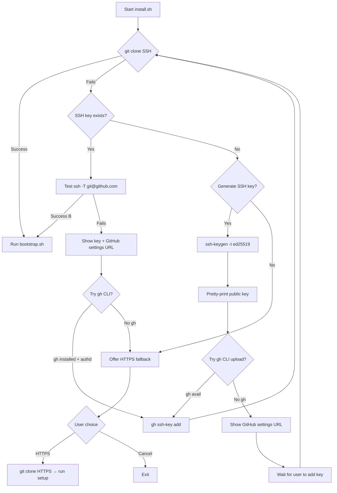

# SSH-First Smart Installer Plan

## Objective

Replace the current `install.sh` with a **SSH-first, HTTPS-fallback** installer that:
- Auto-detects missing SSH keys and generates them
- Pretty-prints the public key for the user
- Opens/links to GitHub SSH settings
- Attempts API-based key upload via `gh` CLI
- Falls back to HTTPS only as last resort

## Flowchart



## Steps

### 1. SSH Key Detection
```bash
# Check for existing SSH keys
if [[ -f ~/.ssh/id_ed25519.pub ]]; then
    SSH_KEY=~/.ssh/id_ed25519.pub
elif [[ -f ~/.ssh/id_rsa.pub ]]; then
    SSH_KEY=~/.ssh/id_rsa.pub
elif [[ -f ~/.ssh/id_ecdsa.pub ]]; then
    SSH_KEY=~/.ssh/id_ecdsa.pub
else
    SSH_KEY=""  # No key found
fi
```

### 2. SSH Key Generation (on user approval)
```bash
ssh-keygen -t ed25519 -C "$USER@$(hostname)" -f ~/.ssh/id_ed25519 -N ""
SSH_KEY=~/.ssh/id_ed25519.pub
```

### 3. Pretty-Print Public Key (formatted box)
```
╔══════════════════════════════════════════════════════════════╗
║                    YOUR SSH PUBLIC KEY                       ║
╠══════════════════════════════════════════════════════════════╣
║                                                              ║
║  ssh-ed25519 AAAAC3NzaC1lZDI1NTE5AAAAIL2j... user@hostname  ║
║                                                              ║
╚══════════════════════════════════════════════════════════════╝
```

### 4. GitHub URL Display (clickable + raw)
- **Clickable (OSC 8):** `\e]8;;https://github.com/settings/ssh/new\e\\🔗 Add SSH Key to GitHub\e]8;;\e\\`
- **Raw URL:** `https://github.com/settings/ssh/new`
- **Direct API-style:** Not available — GitHub requires OAuth for API. Use `gh` CLI instead.

### 5. `gh` CLI Key Upload
```bash
if command -v gh &>/dev/null && gh auth status &>/dev/null; then
    gh ssh-key add "$SSH_KEY" --title "$(hostname)-$(date +%Y%m%d)"
    echo "✅ SSH key added via gh CLI!"
fi
```

### 6. SSH Connection Test
```bash
ssh -T git@github.com 2>&1 | grep -q "successfully authenticated"
```

### 7. Clone Strategy
```bash
# Attempt SSH first
if git clone git@github.com:AmarjithTK/smartDots.git ~/smartDots 2>/dev/null; then
    echo "✅ Cloned via SSH"
else
    # Show key, offer help, fallback to HTTPS
    ...
fi
```

## Functions

| Function | Purpose |
|----------|---------|
| `detect_ssh_key()` | Check for existing SSH keys |
| `generate_ssh_key()` | Generate ed25519 key pair |
| `print_ssh_key_box()` | Pretty-print public key in bordered box |
| `open_github_ssh_url()` | Show GitHub SSH settings link |
| `upload_via_gh()` | Upload key via GitHub CLI |
| `test_ssh_connection()` | `ssh -T git@github.com` check |
| `clone_via_ssh()` | Git clone with SSH |
| `clone_via_https()` | Git clone with HTTPS (fallback) |
| `main_menu()` | Ask user: retry SSH, generate key, use HTTPS, quit |

## Edge Cases

| Case | Handling |
|------|----------|
| No internet | Check with `ping -c 1 github.com` before proceeding |
| `gh` not installed | Skip API upload, show manual instructions |
| `gh` installed but not authenticated | Show `gh auth login` instructions |
| SSH key exists but wrong GitHub account | Show key, let user manage manually |
| Multiple SSH keys | Use first found, show which one |
| Permission denied (publickey) | Show diagnostic: agent running? key added? |
| HTTPS rate limited | Unlikely for public clone, but retry with `--depth 1` |
