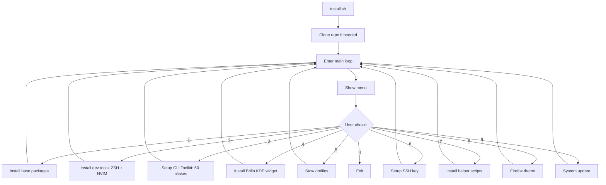

# Unified Single-Script Installer Plan

## Problem

Current flow is scattered:
```
install.sh → SSH clone → bootstrap.sh → menu → packages.sh / devtools.sh / plasmoid-brillo.sh / cli-toolkit/install.sh
```

5+ files, 3 layers of delegation, hard to follow.

## Solution

**One script, one loop.** Replace the entire chain with a single `install.sh` that:



### Single file: `install.sh`

~500-600 lines. All functions defined at the top, menu loop at the bottom.

---

## Menu Layout

```
╔══════════════════════════════════════╗
║       smartDots Mega Installer       ║
╠══════════════════════════════════════╣
║  1) Base packages        [  ]       ║
║  2) Dev tools (ZSH+Nvim) [  ]       ║
║  3) CLI Toolkit          [  ]       ║
║  4) Brillo KDE widget    [  ]       ║
║  5) Stow dotfiles        [  ]       ║
║  6) SSH key setup        [  ]       ║
║  7) Helper scripts       [  ]       ║
║  8) Firefox theme        [  ]       ║
║  9) Update system        [  ]       ║
║  a) Install ALL                   ║
║  q) Quit                          ║
╠══════════════════════════════════════╣
║  [ ] = completed                    ║
║  Repo: ~/smartDots                  ║
╚══════════════════════════════════════╝

Select options (space-separated, e.g. '1 3 5' or 'a' for all):
```

---

## State Tracking

A simple state file at `~/.smartdots/install-state.txt` tracks what's been installed:

```
base_packages=done
dev_tools=done
cli_toolkit=done
brillo=done
stow_dotfiles=done
ssh_key=done
helper_scripts=done
firefox_theme=done
system_updated=done
```

Menu shows `[✓]` for done items, `[ ]` for pending. Re-running is safe — each function is idempotent.

---

## Functions

All defined in `install.sh`:

### `install_base_packages()`
```
sudo pacman -S --noconfirm --needed \
  base-devel git stow curl wget \
  zsh kitty rofi dunst feh \
  brightnessctl ddcutil redshift xclip \
  pulseaudio pavucontrol \
  neovim python nodejs npm distrobox \
  noto-fonts ttf-jetbrains-mono ttf-fira-code
```

### `install_dev_tools()`
- oh-my-zsh (if not exists)
- powerlevel10k (if not exists)
- Ensure `.zshrc` sources `.zshconfig` (merge, not replace)
- NvChad (if not exists, prompt before replacing)
- VSCodium + extensions (if not exists)

### `install_cli_toolkit()`
- Copy `cli-toolkit/registry.txt` → `~/.smartdots/registry.txt`
- Copy `cli-toolkit/smartdots.sh` → `~/.smartdots/smartdots.sh`
- Add source line to shell config (idempotent)
- Source immediately

### `install_brillo()`
- Copy plasmoid files → `~/.local/share/plasma/plasmoids/`
- Add to KDE panel via `kwriteconfig6`
- Set up ddcutil permissions
- Add restore-brightness autostart
- Restart Plasma shell

### `stow_dotfiles()`
- Backup existing config files (with `.bak.timestamp`)
- Stow: kitty, rofi, dunst, firefox, plasma-autostart
- Stow: shell/.zshconfig only (NOT .zshrc)
- Ensure `.zshrc` sources `.zshconfig`

### `setup_ssh_key()`
- Check for existing keys
- Generate ed25519 if missing
- Pretty-print public key
- Try `gh ssh-key add`
- Show GitHub URL
- Test `ssh -T git@github.com`

### `install_helper_scripts()`
- Copy `linux/bin/*` → `~/.local/bin/`
- Add to PATH if not present

### `setup_firefox_theme()`
- Symlink userChrome.css to all profiles

### `update_system()`
```
sudo pacman -Syu
flutter upgrade 2>/dev/null || true
npm update -g 2>/dev/null || true
rustup update 2>/dev/null || true
flatpak update -y 2>/dev/null || true
```

### `install_all()`
Calls all functions in dependency order.

---

## Flow

```bash
# User runs:
bash <(curl -sL https://raw.githubusercontent.com/AmarjithTK/smartDots/main3/install.sh)

# Step 1: Clone repo (SSH-first, HTTPS fallback)
# Step 2: Enter the main loop
# Step 3: User types 'a' or '1 2 3 4 5 7 8'
# Step 4: Each function runs, marks state as done
# Step 5: Loop back to menu
# Step 6: User types 'q' to exit
```

---

## File Comparison

| Before | After |
|--------|-------|
| `install.sh` (292 lines) | `install.sh` (all-in-one, ~550 lines) |
| `linux/setup/bootstrap.sh` (128 lines) | ❌ Deleted — merged into install.sh |
| `linux/setup/packages.sh` (25 lines) | ❌ Deleted — merged into install.sh |
| `linux/setup/devtools.sh` (114 lines) | ❌ Deleted — merged into install.sh |
| `linux/setup/firefox.sh` (36 lines) | ❌ Deleted — merged into install.sh |
| `linux/setup/plasmoid-brillo.sh` (200 lines) | ❌ Deleted — merged into install.sh |
| `cli-toolkit/install.sh` (100 lines) | ❌ Deleted — merged into install.sh |
| **Total: 7 files, ~895 lines** | **1 file, ~550 lines** |

The sub-scripts' content is preserved as **functions** inside `install.sh`. Nothing is lost — just consolidated.

---

## Files that stay

| File | Reason |
|------|--------|
| `cli-toolkit/registry.txt` | Data, not code — stays as-is |
| `cli-toolkit/smartdots.sh` | Runtime file (sourced by shell) — stays |
| `linux/bin/*` | CLI tools — stay |
| `linux/stow/*` | Config files — stay |
| `linux/stow/plasmoids/*` | QML applet — stays |
| `windows/*` | Windows platform — stays |
| `shared/git/*` | Git configs — stays |
| `archive/*` | Reference — stays |

---

## What gets deleted

| File | Replaced by |
|------|-------------|
| `linux/setup/bootstrap.sh` | Function in `install.sh` |
| `linux/setup/packages.sh` | Function in `install.sh` |
| `linux/setup/devtools.sh` | Function in `install.sh` |
| `linux/setup/firefox.sh` | Function in `install.sh` |
| `linux/setup/plasmoid-brillo.sh` | Function in `install.sh` |
| `cli-toolkit/install.sh` | Function in `install.sh` |
